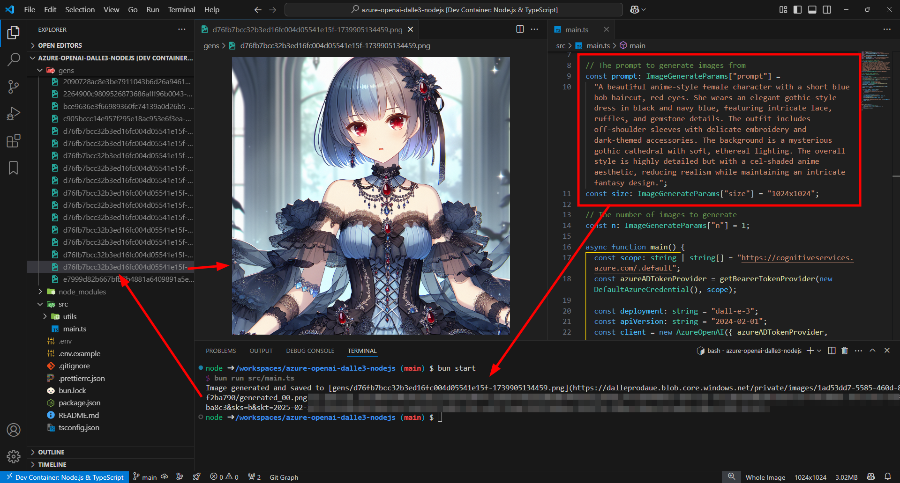

# Azure OpenAI DALL-E 3 Node.js

This application utilizes Azure OpenAI's API to generate images based on a given prompt. The generated images are saved to the local filesystem.



## Preparation

Login to Azure and create a new resource for OpenAI. Ensure that you assign the "Cognitive Services OpenAI User" role to access the OpenAI API.

```bash
az login
```

## Getting Started

Create a `.env` file and configure the environment variables:

```bash
cp .env.example .env
```

Install dependencies:

```bash
bun install
```

Run the application:

Modify the `prompt` and `size` variables in the code to adjust the style and resolution of the generated images.

```bash
bun start
```

Run unit tests:

```bash
bun test
bun test:watch
```

---

This project was created using `bun init` in bun v1.2.2. [Bun](https://bun.sh) is a fast all-in-one JavaScript runtime.
